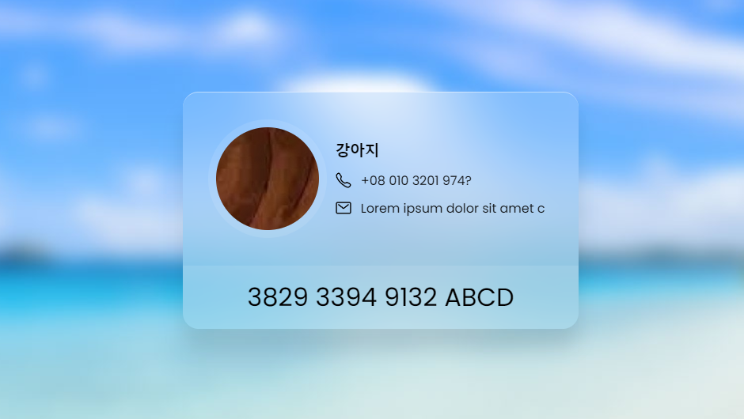
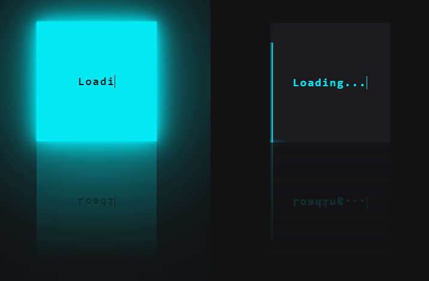

# mini_pjt
이것저것 만들어보는 프로젝트

### 10/20 Glassmorphism Card

#CSS #HTML

- 핵심은 카드의 블러처리와 카드위에 광택처럼주기위해 border-top 을 주는것!
- css 만으로 동적인 페이지를 시도할수있다는 점이 크게 와닿았음
- 남의 코드를 살펴본 결과 상당히 깔끔한 코드로 진행이되서 이를 보고 많이 배웠다.
  - CSS 스타일을 태그 요소기준으로 계층적으로 쌓아가는것
  - CSS를 깔끔하게 함으로서 HTML에도 간단한 코드로 이루어지게 됨

참조: https://www.youtube.com/watch?v=Glsby66vuLA&t=30s

---------

### 10/25 NeonLodingSpinner

#CSS #HTML

- 공부 심히 필요!! 
  - webkit
  - animation
    - keyframes

참조: https://www.youtube.com/watch?v=3wRBJESwarQ&ab_channel=OnlineTutorials

--------
